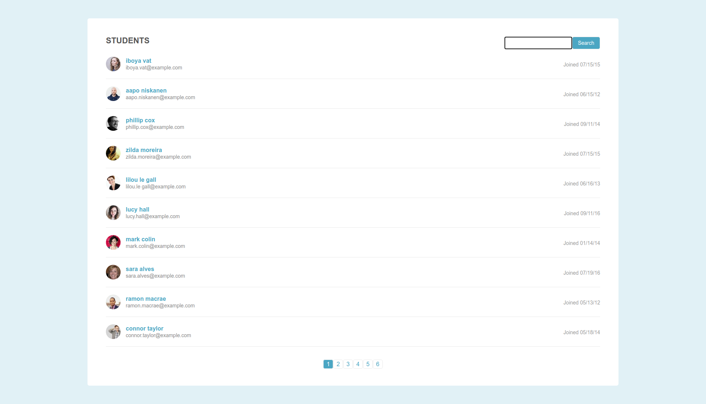

# Teamtreehouse Fullstack Techdegree - Project 2

This is a solution to the second project for the Fullstack Techdegree course.

## Table of contents

- [Overview](#overview)
  - [The challenge](#the-challenge)
  - [Screenshot](#screenshot)
  - [Links](#links)
- [My process](#my-process)
  - [Built with](#built-with)
  - [What I learned](#what-i-learned)
  - [Continued development](#continued-development)
- [Author](#author)

## Overview

### The challenge

Users should be able to:

- Make a paginated responsive searchable site with some dummy student data.

### Screenshot

### Links

- Solution URL: https://github.com/electrictxubi/fullstack-project2
- Live Site URL: https://electrictxubi.github.io/fullstack-project2

## My process

### Built with

- Semantic HTML5 markup
- CSS custom properties
- Javascript

### What I learned

I learned how to make pagination and how to implement a search feature.

### Continued development

I would love to implement this into a bigger site and use an API instead of dummy data.

## Author

- Jon Avila
- avila9@protonmail.com
